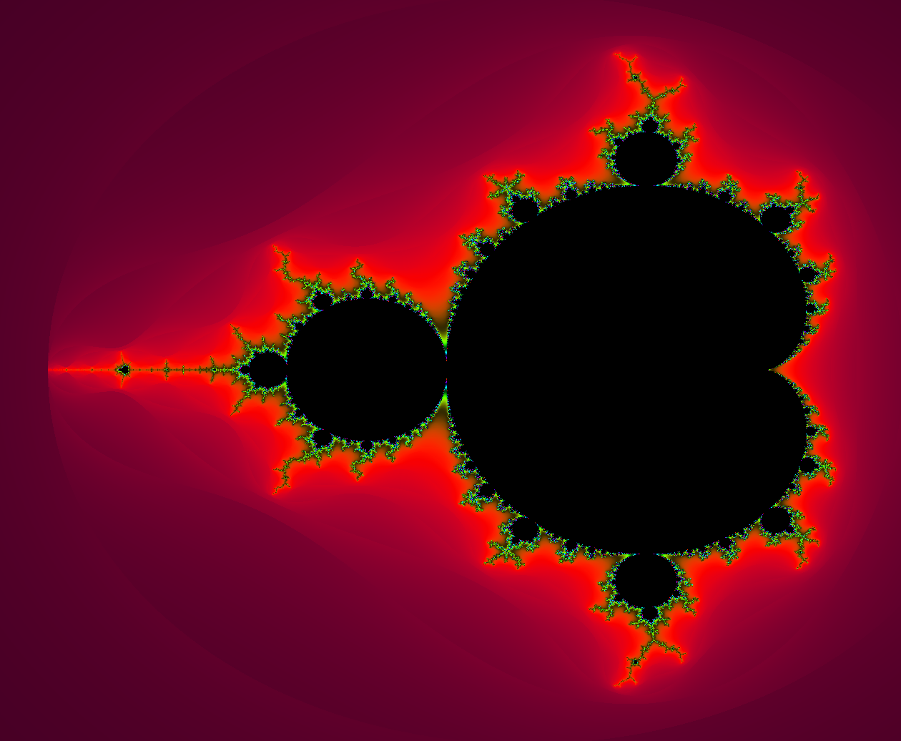

# Mandelbrot-Viewer

## Overview
Mandelbrot fractal viewer with zoom/pan camera functionality.  For use with the [Legit Game Engine](https://github.com/brock-eng/Legit-Game-Engine).

## Controls
- To pan the viewport, left click and drag
- Zoom with mouse scroll and W/S keys (exclusively W/S on browser version)
- Increase/decrease iteration count by +-10 with UP/DOWN arrow keys

## About
The mandelbrot fractal is perhaps the worlds most popular fractal piece, with hundreds of videos on youtube showcasing extreme zooms into the infinite structure.  Despite its complex appearance, the mandelbrot set is the result of a simple equation that is expressed in only three terms: Zn+1 = Zn^2 + C.  The set consists of all numbers that do not blow up to infinity when input into this equation as C and starting with Z= 0. While the picture created as part of this program is filled with incredible color variety, the actual set itself consists of the black portion.  The colors that we see when we look at most mandelbrot viewers are actually a color scheme used to describe how fast the input number grows when the given input diverges.  

This program uses a shader file to implement the mandelbrot algorithm.  The zoom level is limited to floating point precision.

## External Resources
Coloring algorithm taken from https://gist.github.com/patriciogonzalezvivo/
